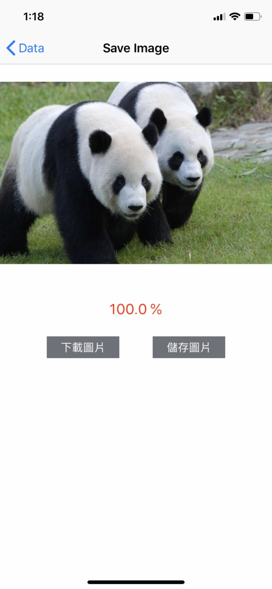
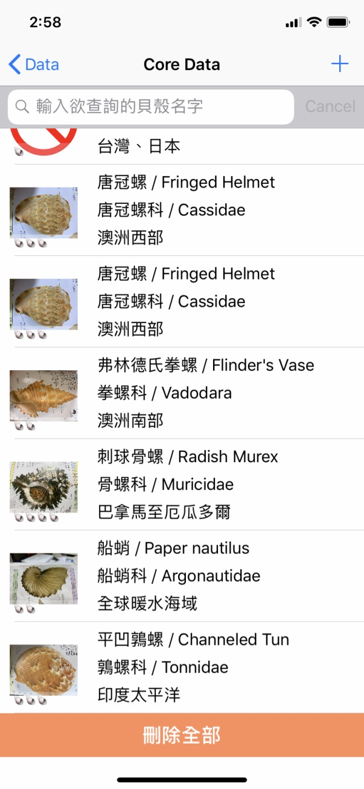
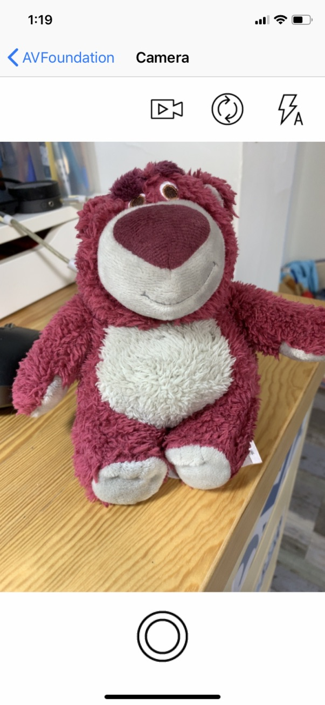

# SwiftDemo

### 集合了一些常用的功能 Demo （持續更新中）

* 動物園的動物：實作與web server串接下載動物資料（JSON格式）及圖片，將動物資訊及圖片顯示在UITable中

    
* 圖片儲存：實作FileManager儲存圖片

    
* 貝殼型錄：實作CoreData，可新增貝殼資訊，將貝殼資料顯示在UITable中

    
* 照相機：實作AVFoundation，可拍照、錄影、切換前後相機、開啟關閉閃光燈

    
